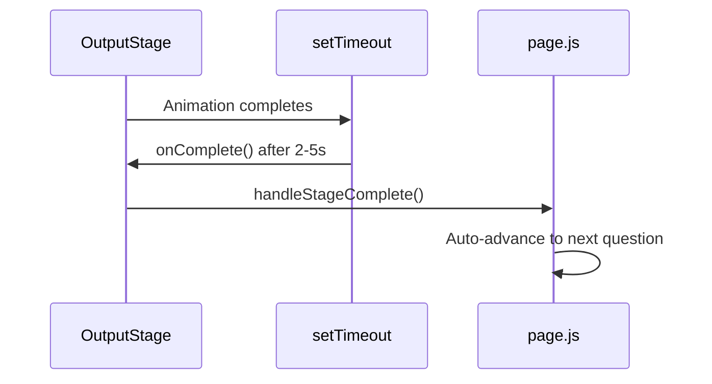
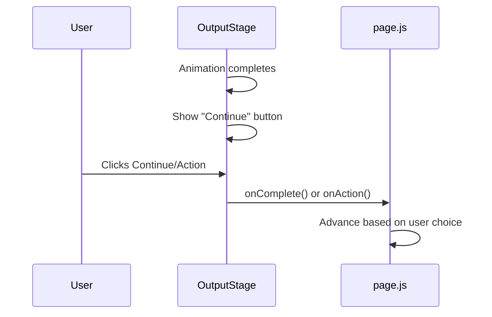

# MRO Enterprise UX Uplift Plan

## Problem Summary

The current MRO implementation has three critical issues preventing enterprise-grade appearance:

1. **Auto-advancement**: All 11 MRO output stages auto-complete via `setTimeout` after animations finish (2-5 seconds), removing user control
2. **No interactivity**: Stages display data but lack buttons, drill-down, write-back confirmations, or parameter editing
3. **Broken ontology graph**: Nodes compressed vertically (Y: 80-1320), limited to 40 nodes, messy edge routing, poor visibility

---

## Architecture Changes

### Current Flow (Problematic)



### Target Flow (User-Controlled)



---

## Implementation Plan

### Phase 1: Remove Auto-Completion (11 Files)

Remove all `setTimeout(() => onComplete?.(), ...)` patterns from MRO stages and add explicit continue buttons.

**Files to modify:**

| File | Current Timeout | Change |

|------|----------------|--------|

| [`MROAgentNetworkStage.js`](src/app/cerebra-demo/components/outputStages/mro/MROAgentNetworkStage.js) | ~2s | Add "Proceed to Triage" button |

| [`MROControlTowerStage.js`](src/app/cerebra-demo/components/outputStages/mro/MROControlTowerStage.js) | 2.5s | Add "Continue to Alerts" button |

| [`MROAIPAgentStage.js`](src/app/cerebra-demo/components/outputStages/mro/MROAIPAgentStage.js) | ~3s | Add "Proceed" button |

| [`MROAlertTriageStage.js`](src/app/cerebra-demo/components/outputStages/mro/MROAlertTriageStage.js) | ~3s | Add "Investigate Selected" button |

| [`MROAlertDetailStage.js`](src/app/cerebra-demo/components/outputStages/mro/MROAlertDetailStage.js) | ~4s | Add "Run Simulation" button |

| [`MROScenarioBuilderStage.js`](src/app/cerebra-demo/components/outputStages/mro/MROScenarioBuilderStage.js) | ~5s | Add "Apply Selected Strategy" button |

| [`MROActionPackStage.js`](src/app/cerebra-demo/components/outputStages/mro/MROActionPackStage.js) | ~4s | Add "Submit for Approval" button |

| [`MROApprovalStage.js`](src/app/cerebra-demo/components/outputStages/mro/MROApprovalStage.js) | ~4s | Add "Approve and Execute" button |

| [`MROMBHDashboardStage.js`](src/app/cerebra-demo/components/outputStages/mro/MROMBHDashboardStage.js) | ~4s | Add "Investigate Exception" button |

| [`MROMBHResolveStage.js`](src/app/cerebra-demo/components/outputStages/mro/MROMBHResolveStage.js) | ~4s | Add "Execute Corrections" button |

| [`MROAutomationStage.js`](src/app/cerebra-demo/components/outputStages/mro/MROAutomationStage.js) | ~4s | Add "Finalize Session" button |

**Pattern to apply (example):**

```javascript
// REMOVE this pattern:
setTimeout(() => {
  if (!hasCompletedRef.current) {
    hasCompletedRef.current = true;
    onComplete?.();
  }
}, 2500);

// ADD state for animation completion:
const [animationComplete, setAnimationComplete] = useState(false);

// In last animation timeout:
setTimeout(() => setAnimationComplete(true), 2500);

// ADD continue button in render:
{animationComplete && (
  <button onClick={() => onComplete?.()}>
    Continue to Next Step
  </button>
)}
```

---

### Phase 2: Add Interactive Elements

#### 2A. MROScenarioBuilderStage - Add Write-Back Simulation

Add interactive selection with visual feedback:

```javascript
// Add to MROScenarioBuilderStage.js
const [selectedOption, setSelectedOption] = useState(null);
const [isExecuting, setIsExecuting] = useState(false);

// "Apply Strategy" button with loading state:
<button 
  disabled={!selectedOption || isExecuting}
  onClick={async () => {
    setIsExecuting(true);
    await simulateWriteBack(); // 1.5s loading animation
    onComplete?.();
  }}
>
  {isExecuting ? 'Writing to SAP...' : 'Apply Selected Strategy'}
</button>
```

#### 2B. MROActionPackStage - Add SAP Transaction Buttons

Add per-action "Execute" buttons with confirmation:

```javascript
// Per action card:
<button onClick={() => executeAction(action.id)}>
  Execute in SAP
</button>

// With confirmation modal pattern:
const [confirmAction, setConfirmAction] = useState(null);

{confirmAction && (
  <ConfirmationModal
    title={`Execute ${confirmAction.title}?`}
    onConfirm={() => {
      simulateSAPWrite(confirmAction);
      setConfirmAction(null);
    }}
    onCancel={() => setConfirmAction(null)}
  />
)}
```

#### 2C. MROAlertTriageStage - Add Row Selection and Bulk Actions

Add interactive table with row selection:

```javascript
const [selectedAlerts, setSelectedAlerts] = useState([]);

// Checkbox column in table
// "Investigate Selected" or "Bulk Triage" action bar
// Filter chips that actually filter the data
```

#### 2D. MROControlTowerStage - Add Node Click Handlers

Make network topology interactive:

```javascript
// On node click:
const handleNodeClick = (node) => {
  setSelectedNode(node);
  // Show detail panel
};

// Pulsing critical nodes should be clickable to drill down
```

---

### Phase 3: Ontology Graph Overhaul

The [`MROOntologyGraphModal.js`](src/app/cerebra-demo/components/visualizations/MROOntologyGraphModal.js) requires major restructuring.

#### 3A. Fix Node Layout Algorithm

**Current issue**: Nodes positioned linearly Y: 80-1320, causing vertical compression into ~550px viewport.

**Solution**: Implement hierarchical layout by category:

```javascript
function calculateNodePositions(nodes) {
  const categoryOrder = ['Fleet', 'Maintenance', 'Material', 'Repair', 'Procurement', 'Logistics', 'Commercial', 'Operations', 'Governance'];
  
  // Group nodes by category
  const grouped = {};
  nodes.forEach(node => {
    const cat = MRO_ENTITY_TYPES[node.type]?.category || 'Other';
    if (!grouped[cat]) grouped[cat] = [];
    grouped[cat].push(node);
  });
  
  // Layout in horizontal bands
  const positions = {};
  const bandHeight = 100;
  const nodeSpacing = 120;
  
  categoryOrder.forEach((cat, catIdx) => {
    const catNodes = grouped[cat] || [];
    catNodes.forEach((node, nodeIdx) => {
      positions[node.id] = {
        x: 100 + nodeIdx * nodeSpacing,
        y: 60 + catIdx * bandHeight
      };
    });
  });
  
  return positions;
}
```

#### 3B. Improve Edge Routing

**Current issue**: Straight lines with basic curves cause visual clutter.

**Solution**: Use bezier curves with intelligent routing:

```javascript
function calculateEdgePath(fromPos, toPos, isUpward) {
  const midY = (fromPos.y + toPos.y) / 2;
  const controlOffset = Math.abs(toPos.x - fromPos.x) * 0.3;
  
  // S-curve for cleaner routing
  return `M ${fromPos.x} ${fromPos.y} 
          C ${fromPos.x} ${midY - controlOffset} 
            ${toPos.x} ${midY + controlOffset} 
            ${toPos.x} ${toPos.y}`;
}
```

#### 3C. Add Zoom and Filter Controls

```javascript
// Add category filter buttons
const [visibleCategories, setVisibleCategories] = useState(new Set(categoryOrder));

// Add minimap navigation
// Add fit-to-view button
// Increase node size for better clickability
```

#### 3D. Improve Modal Layout

- Increase graph area from 900x550 to 100% of available modal space
- Add category legend with toggle filters
- Show node count per category
- Add keyboard navigation (arrow keys to traverse graph)

---

### Phase 4: Chart and Visual Quality Uplift

#### 4A. Network Topology in MROControlTowerStage

Replace basic SVG with interactive canvas:

```javascript
// Add hover states
// Add click handlers to show detail panels
// Add animated data flows between nodes
// Use gradient fills instead of flat colors
```

#### 4B. KPI Cards Enhancement

- Add sparklines to KPI cards
- Add click-to-drill capability
- Add trend indicators with actual data

#### 4C. Timeline Charts in MROAlertDetailStage

- Make chart interactive (hover to see values)
- Add zoom/pan capability
- Add annotation markers for key events

---

## File Change Summary

| Priority | File | Changes |

|----------|------|---------|

| P0 | All 11 MRO stage files | Remove auto-complete, add continue buttons |

| P1 | [`MROScenarioBuilderStage.js`](src/app/cerebra-demo/components/outputStages/mro/MROScenarioBuilderStage.js) | Add write-back simulation with loading states |

| P1 | [`MROActionPackStage.js`](src/app/cerebra-demo/components/outputStages/mro/MROActionPackStage.js) | Add per-action execute buttons |

| P1 | [`MROOntologyGraphModal.js`](src/app/cerebra-demo/components/visualizations/MROOntologyGraphModal.js) | Complete layout overhaul |

| P2 | [`MROControlTowerStage.js`](src/app/cerebra-demo/components/outputStages/mro/MROControlTowerStage.js) | Interactive network topology |

| P2 | [`MROAlertTriageStage.js`](src/app/cerebra-demo/components/outputStages/mro/MROAlertTriageStage.js) | Row selection and bulk actions |

| P3 | [`mroOntologyData.js`](src/app/cerebra-demo/data/mro/mroOntologyData.js) | Update node positions for horizontal layout |

---

## Testing Checklist

After implementation, verify:

- [ ] No stage auto-advances without user action
- [ ] All continue buttons are visible and functional
- [ ] Write-back simulations show loading states
- [ ] Ontology graph displays nodes without overlap
- [ ] Graph is zoomable and pannable
- [ ] Network topology nodes are clickable
- [ ] Alert triage allows row selection
- [ ] Run full E2E test with `node scripts/mro-e2e-test.mjs`